# Mermaid Architecture Diagrams

## 1. High-Level System Architecture


## 2. Detailed Query Flow


## 3. Component Architecture


## 4. Data Flow Architecture


## 5. MCP Server Tool Registry

```mermaid
graph TB
    subgraph "Wazuh MCP Server"
        FastMCP[FastMCP Application<br/>uvicorn + SSE]
        
        FastMCP --> Tools[Tool Registry]
        
        Tools --> Auth[AuthenticateTool<br/>JWT Token Refresh]
        Tools --> Agents[GetAgentsTool<br/>List/Search Agents]
        Tools --> Ports[GetAgentPortsTool<br/>Network Ports Info]
        Tools --> Packages[GetAgentPackagesTool<br/>Installed Packages]
        Tools --> Processes[GetAgentProcessesTool<br/>Running Processes]
        Tools --> Rules[ListRulesTool<br/>Detection Rules]
        Tools --> RuleFile[GetRuleFileContentTool<br/>Rule XML Content]
        Tools --> RuleFiles[GetRuleFilesTool<br/>List Rule Files]
        Tools --> SCA[GetAgentSCATool<br/>Security Compliance]
        Tools --> SCAChecks[GetSCAPolicyChecksTool<br/>Detailed Checks]
    end
    
    subgraph "Wazuh Client"
        HTTPClient[Async HTTP Client<br/>httpx with HTTP/2]
        TokenMgr[JWT Token Manager<br/>Auto-refresh]
        
        HTTPClient --> TokenMgr
    end
    
    subgraph "Wazuh Manager API"
        API[REST API Endpoints<br/>Port 55000]
        
        API --> AgentsAPI[/agents]
        API --> SysAPI[/syscollector]
        API --> RulesAPI[/rules]
        API --> SCAAPI[/sca]
    end
    
    Auth --> HTTPClient
    Agents --> HTTPClient
    Ports --> HTTPClient
    Packages --> HTTPClient
    Processes --> HTTPClient
    Rules --> HTTPClient
    RuleFile --> HTTPClient
    RuleFiles --> HTTPClient
    SCA --> HTTPClient
    SCAChecks --> HTTPClient
    
    HTTPClient --> API
    
    style FastMCP fill:#e1f0ff
    style HTTPClient fill:#ffe1f0
    style API fill:#f0ffe1
```

## 6. Elasticsearch Query Construction


## 7. AI Intelligence Flow

```mermaid
graph TB
    subgraph "AI Query Analysis Phase"
        UserQuery[User Query Text]
        
        UserQuery --> Prompt1[Generate Analysis Prompt<br/>Security expert context<br/>JSON schema specification]
        
        Prompt1 --> GroqCall1[Groq LLM API Call<br/>ainvoke method]
        
        GroqCall1 --> Parse1[Parse Response<br/>Extract JSON]
        
        Parse1 --> Validate1{Valid JSON?}
        
        Validate1 -->|Yes| StructuredAnalysis[Structured Analysis Object<br/>intent, entities, approach,<br/>confidence, reasoning]
        Validate1 -->|No| KeywordAnalysis[Fallback Keyword Analysis<br/>Regex patterns, word matching]
        
        KeywordAnalysis --> StructuredAnalysis
    end
    
    subgraph "Data Retrieval Phase"
        StructuredAnalysis --> ExecutionEngine[Execution Engine]
        ExecutionEngine --> RawData[Raw Data Results<br/>Events, agents, metrics]
    end
    
    subgraph "AI Formatting Phase"
        RawData --> Summarize[Summarize Raw Data<br/>Count metrics, extract samples]
        
        Summarize --> Prompt2[Generate Formatting Prompt<br/>Security analyst persona<br/>Professional report structure]
        
        Prompt2 --> GroqCall2[Groq LLM API Call<br/>ainvoke method]
        
        GroqCall2 --> Parse2[Parse Response<br/>Extract insights]
        
        Parse2 --> Validate2{AI Success?}
        
        Validate2 -->|Yes| IntelligentReport[🧠 Intelligent Security Report<br/>Executive summary<br/>Risk assessment<br/>Recommendations<br/>Technical details]
        
        Validate2 -->|No| FallbackReport[📋 Structured Fallback Report<br/>Findings table<br/>Basic analysis<br/>Generic recommendations]
        
        IntelligentReport --> FinalOutput[Final User Output]
        FallbackReport --> FinalOutput
    end
    
    style UserQuery fill:#e1f5ff
    style GroqCall1 fill:#ffe1e1
    style GroqCall2 fill:#ffe1e1
    style IntelligentReport fill:#e1ffe1
    style FinalOutput fill:#fff4e1
```



## 8. Error Handling & Fallback Strategy

```mermaid
flowchart TD
    Start[System Start] --> CheckES{Elasticsearch<br/>Available?}
    
    CheckES -->|Yes| ESReady[✅ ES Ready]
    CheckES -->|No| ESWarn[⚠️ ES Unavailable<br/>Set es = None]
    
    ESReady --> CheckLLM{Groq LLM<br/>Configured?}
    ESWarn --> CheckLLM
    
    CheckLLM -->|Yes| LLMReady[✅ LLM Ready]
    CheckLLM -->|No| LLMWarn[⚠️ LLM Unavailable<br/>Set decision_llm = None]
    
    LLMReady --> QueryPhase[Query Processing Phase]
    LLMWarn --> QueryPhase
    
    QueryPhase --> TryAI{AI Analysis<br/>Available?}
    
    TryAI -->|Yes| AIAnalysis[AI Query Analysis]
    TryAI -->|No| KeywordAnalysis[Keyword Fallback]
    
    AIAnalysis --> AISuccess{AI Parse<br/>Success?}
    
    AISuccess -->|Yes| ExecutePlan[Execute Query Plan]
    AISuccess -->|No| KeywordAnalysis
    
    KeywordAnalysis --> ExecutePlan
    
    ExecutePlan --> ESQuery{ES Query<br/>Needed?}
    
    ESQuery -->|Yes| ESAvailable{ES<br/>Available?}
    ESQuery -->|No| MCPOnly[MCP Server Only]
    
    ESAvailable -->|Yes| QueryES[Query Elasticsearch]
    ESAvailable -->|No| MockData[Return Mock Data<br/>+ Error Message]
    
    QueryES --> ESError{ES Error?}
    
    ESError -->|Yes| LogError[Log Error<br/>Continue with partial data]
    ESError -->|No| ESResults[ES Results]
    
    LogError --> Aggregate[Aggregate Results]
    ESResults --> Aggregate
    MockData --> Aggregate
    MCPOnly --> Aggregate
    
    Aggregate --> TryFormat{AI Formatting<br/>Available?}
    
    TryFormat -->|Yes| AIFormat[AI Response Formatting]
    TryFormat -->|No| BasicFormat[Basic Structured Format]
    
    AIFormat --> FormatSuccess{Format<br/>Success?}
    
    FormatSuccess -->|Yes| FinalReport[Final Report]
    FormatSuccess -->|No| BasicFormat
    
    BasicFormat --> FinalReport
    
    FinalReport --> UserOutput[📊 Display to User]
    
    style ESReady fill:#90EE90
    style LLMReady fill:#90EE90
    style ESWarn fill:#FFD700
    style LLMWarn fill:#FFD700
    style MockData fill:#FFB6C1
    style LogError fill:#FFB6C1
```



## 9. Authentication & Token Management (MCP Server)


## 10. Complete System Interaction (Real Example)

```mermaid
sequenceDiagram
    participant User as 👤 Security Analyst
    participant CLI as Command Line Interface
    participant Analyzer as Intelligent Analyzer
    participant Groq as 🧠 Groq LLM
    participant ES as 🔍 Elasticsearch
    participant MCP as 🔧 MCP Server
    participant Wazuh as Wazuh Manager

    User->>CLI: "Show me failed login attempts from yesterday"
    CLI->>Analyzer: analyze_query(query)
    
    Note over Analyzer: 🧠 Step 1: AI Analysis
    Analyzer->>Groq: Analyze query intent<br/>(Natural language → Structured)
    Groq-->>Analyzer: {"intent": "authentication",<br/>"action_type": "failed",<br/>"time_range": "yesterday"}
    
    Note over Analyzer: 📋 Step 2: Create Plan
    Analyzer->>Analyzer: _create_execution_plan()<br/>Plan: Query Elasticsearch for auth events
    
    Note over Analyzer: ⚡ Step 3: Execute
    Analyzer->>Analyzer: _execute_elasticsearch_query()
    
    Analyzer->>Analyzer: _build_auth_elasticsearch_query()<br/>Build DSL with:<br/>- Time: yesterday 00:00-23:59<br/>- Type: authentication_failed<br/>- Level: >= 5
    
    Analyzer->>ES: POST /wazuh-alerts-*/_search<br/>DSL Query
    ES-->>Analyzer: 35 hits returned<br/>[{timestamp, src_ip, user, rule}...]
    
    Note over Analyzer: 🎨 Step 4: Format Response
    Analyzer->>Analyzer: _format_detailed_response()<br/>Extract: IPs, users, patterns
    
    Analyzer->>Groq: Generate security analysis for:<br/>- 35 failed attempts<br/>- 20 from IP 192.168.1.99<br/>- Targeting root/admin<br/>- 2-min intervals
    
    Groq-->>Analyzer: "⚠️ BRUTE FORCE DETECTED<br/>High-risk pattern identified.<br/>Recommendations:<br/>1. Block IP immediately<br/>2. Enable fail2ban<br/>3. Review account security"
    
    Analyzer->>CLI: Formatted Report:<br/>================<br/>FINDINGS: 35 events<br/>ANALYSIS: Brute force attack<br/>RECOMMENDATIONS: [...]<br/>DETAILS: [Sample events]
    
    CLI->>User: Display formatted report
```



---

## How to Use These Diagrams

### For Documentation:
1. Copy the code blocks into Markdown files
2. GitHub, GitLab, and many editors render Mermaid automatically
3. Use online tools like [mermaid.live](https://mermaid.live) to preview

### For Presentations:
1. Export as SVG/PNG from mermaid.live
2. Import into PowerPoint/Google Slides
3. Use in technical design documents

### For Code Comments:
- Reference diagram numbers in your code
- Example: `# See Diagram 2 (Query Flow) for sequence`

---

## Diagram Legend

- 🎯 = Main orchestration component
- 🧠 = AI/LLM component  
- 🔍 = Data storage/search
- 🔧 = API/Tool layer
- 👤 = Human user
- 📊 = Output/Report

### Color Coding:
- **Light Blue** = User interface
- **Light Red** = AI/LLM operations
- **Light Yellow** = Processing/orchestration
- **Light Green** = Data retrieval
- **Light Purple** = API/middleware
